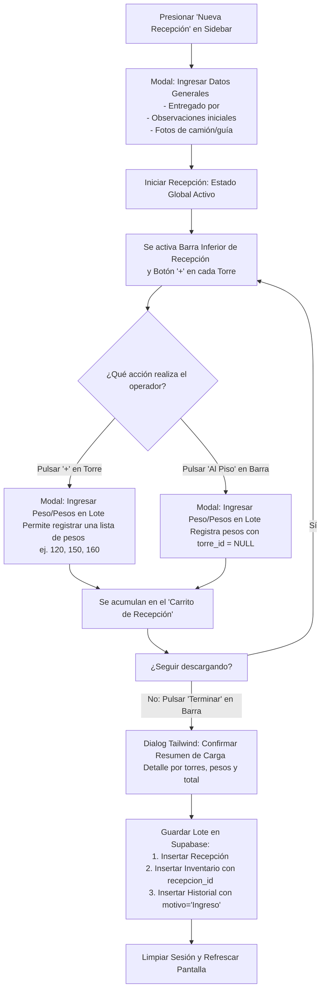
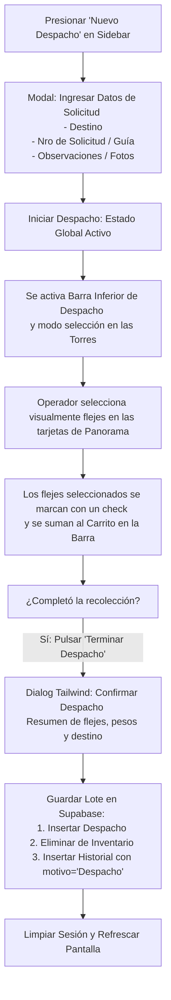

# Plan de Implementación: Flujos de Trazabilidad por Lotes (Recepción y Despacho)

Este documento detalla el diseño de experiencia de usuario (UX) y la lógica de ingeniería para los flujos de **Recepción de Camión (Ingreso)**, **Despacho (Salida/Consumo)** y **Ajustes en Torre** en el *Sistema de Flejes*.

---

## 1. Diagramas de Flujo (Mermaid)

### Proceso A: Recepción (Ingreso por Lote)

---

### Proceso B: Despacho (Salida / Consumo por Lote)

---

## 2. Experiencia de Usuario (UX) Detallada

### A. Recepción de Camión (Ingreso Global)
1. **Inicio de Flujo**: Un botón destacado en el menú lateral o cabecera inicia el flujo. Despliega un formulario centrado para registrar la entrega.
2. **Modo Activo**: Al iniciar la sesión, se bloquea la navegación ordinaria y aparece una barra flotante en la base de la pantalla:
   * **Visualización**: `Recepción Activa | Entregado por: [Nombre] | [X] Flejes | [Total] kg`
   * **Acciones**: `[+ Agregar al Piso]` `[Terminar Recepción]` `[Cancelar]`
3. **Ingreso por Lote en Torre**: Al presionar `[+]` en cualquier torre de Panorama, se abre un modal con un input numérico y una lista temporal local:
   * El operador digita un peso (ej: `1200`), presiona `Enter` (o pulsa `[+]`), y el peso se suma a la lista local.
   * Puede ingresar múltiples pesos consecutivamente.
   * Al presionar `Confirmar`, este lote temporal de pesos se asigna a la torre en el "carrito" de la sesión activa de recepción.
4. **Finalización Transaccional**: Al pulsar `Terminar Recepción`, se abre un diálogo estilizado de confirmación con el resumen de la carga. Al aceptar, se envían todos los registros en una sola transacción a Supabase.

### B. Despacho (Salida Global)
1. **Inicio de Flujo**: Botón "Nuevo Despacho" en la cabecera/menú lateral. Pide el destino, nro de solicitud y observaciones.
2. **Modo Activo**: Al iniciar, las torres vacías se atenúan. Las torres con flejes muestran un estado interactivo donde pulsar sobre un fleje lo selecciona (con check visual y color destacado).
3. **Barra de Sesión**: En el pie de pantalla se muestra:
   * **Visualización**: `Despacho Activo | Destino: [Destino] (Solicitud: [Nro]) | [Y] Seleccionados | [Total] kg`
   * **Acciones**: `[Confirmar Despacho]` `[Cancelar]`
4. **Cierre Transaccional**: Al confirmar, se realiza el egreso de los flejes seleccionados en lote, registrando los movimientos en el historial de forma atómica.

### C. Ajuste Fino en Detalle de Torre (Drawer)
1. **Cambio de Botón**: Cambiaremos el botón "Editar Torre" en la cabecera del Drawer por **"Ingresar Fleje"** (deshabilitado si la torre está llena).
2. **Ingreso por Grupo**: Al hacer clic en "Ingresar Fleje", abrirá el mismo modal de ingreso múltiple local (lista de pesos temporal), permitiendo hacer ajustes de stock rápidos en lote directamente en la torre sin necesidad de abrir una recepción global.
3. **Remoción de Input Individual**: Eliminaremos el input numérico 1-a-1 de peso que está al pie del Drawer de detalle para evitar confusiones y unificar el flujo de ingresos.

---

## 3. Cambios Propuestos en Archivos

### [MODIFY] [App.jsx](file:///c:/Users/anthony/Downloads/supabase/supabase/src/App.jsx)
* **Estados**:
  * `receptionSession`: `{ entregado_por, observaciones, fotos, items: [] }` (donde `items` tiene `{ torre_id, peso }`).
  * `dispatchSession`: `{ destino, num_solicitud, observaciones, fotos, items: [] }` (donde `items` es un array de IDs de flejes seleccionados).
* **Barra de Estado Activa**: Renderizar en el pie de la aplicación la barra correspondiente cuando alguna sesión esté activa.
* **Confirmación de Lotes**: Modales de confirmación Tailwind Premium para guardar Recepción y Despacho.
* **Operaciones Supabase**:
  * `completarRecepcion`: Inserta fila en `recepciones`, luego inserta lote en `inventario` y `historial`.
  * `completarDespacho`: Inserta fila en `despachos`, elimina lote en `inventario` e inserta lote en `historial` (arrastrando el `recepcion_id` original de cada fleje para auditoría).

### [MODIFY] [PanoramaView.jsx](file:///c:/Users/anthony/Downloads/supabase/supabase/src/components/PanoramaView.jsx)
* **Visualización en Sesiones**:
  * Si hay Recepción activa: Muestra botón `[+]` encima o al pie de las bobinas en cada torre (si tiene capacidad libre) que abre el modal de ingreso en lote.
  * Si hay Despacho activo: Muestra casillas o bordes interactivos en las bobinas. Al tocarlas, se agregan/quitan de la lista de selección.
* **Visualización Ordinaria**: Mantiene el comportamiento actual (abrir Drawer al hacer clic en la tarjeta).

### [MODIFY] [DetailDrawer.jsx](file:///c:/Users/anthony/Downloads/supabase/supabase/src/components/DetailDrawer.jsx)
* Reemplazar botón de cabecera "Editar Torre" por "Ingresar Fleje".
* Remover input individual e integrar el modal de ingreso local en lote.

---

## 4. Plan de Verificación

1. **Prueba de Recepción**:
   * Abrir "Nueva Recepción", ingresar "Transportes Express", observaciones.
   * Agregar 3 flejes a P34 (120, 150, 1780) y 2 flejes "Al Piso".
   * Terminar recepción y verificar que P34 muestre `#1 = 1780`, `#2 = 150` y `#3 = 120` (gravedad correcta) y que se hayan guardado en `inventario` e `historial` correctamente con su `recepcion_id`.
2. **Prueba de Despacho**:
   * Abrir "Nuevo Despacho" hacia "Planta A" con solicitud "SL-104".
   * Seleccionar el fleje `#2 (150)` de P34 y otro de P33.
   * Terminar despacho y verificar que desaparezcan del Panorama, que la secuencia de P34 se reajuste automáticamente (dejando `#1 = 1780` and `#2 = 120`), y que el historial documente la salida.
3. **Prueba de Build y Lints**:
   * Ejecutar `pnpm run build` y `pnpm run lint` para garantizar código libre de errores.
